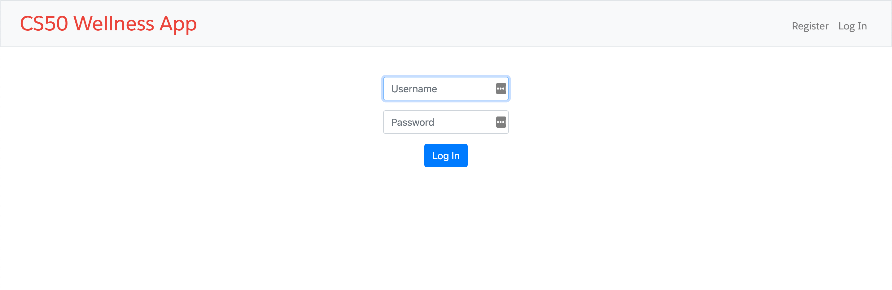
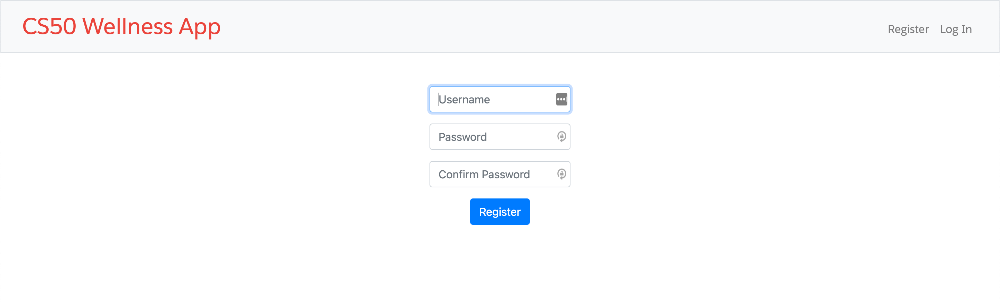
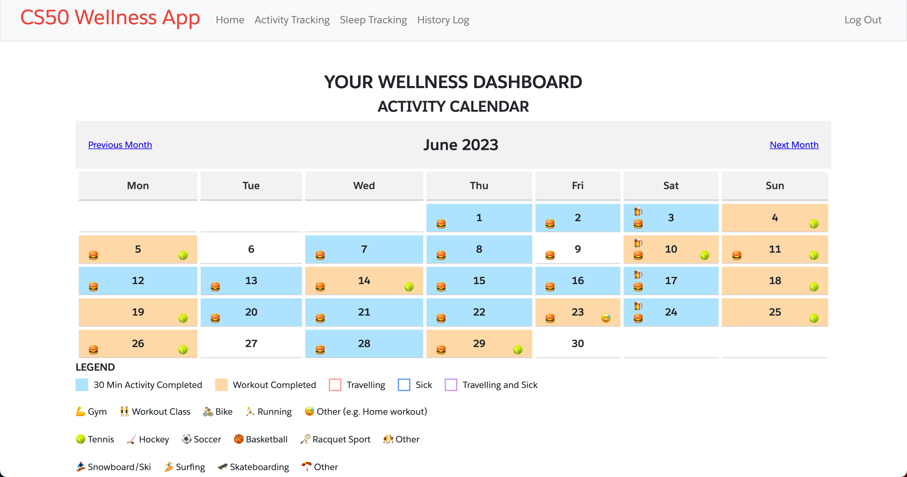
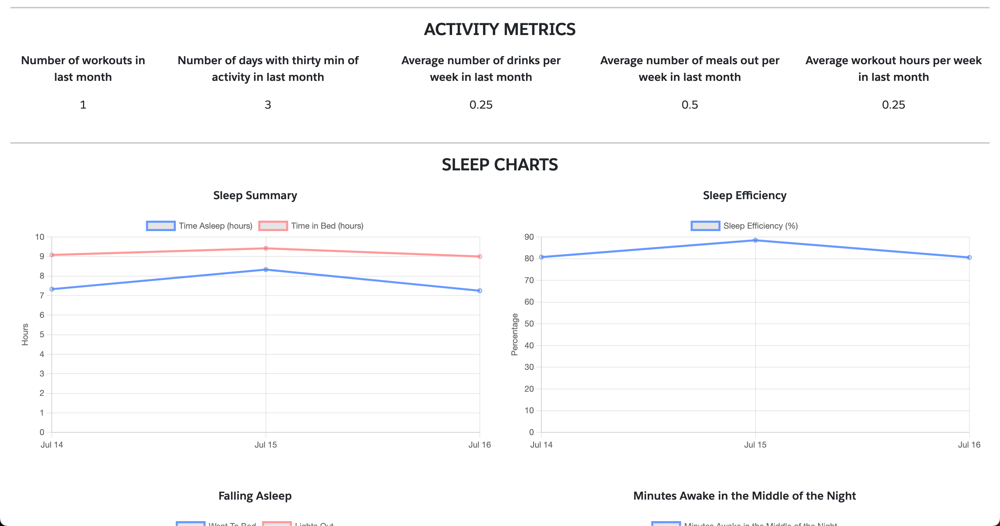
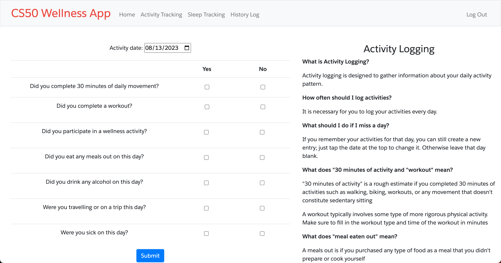
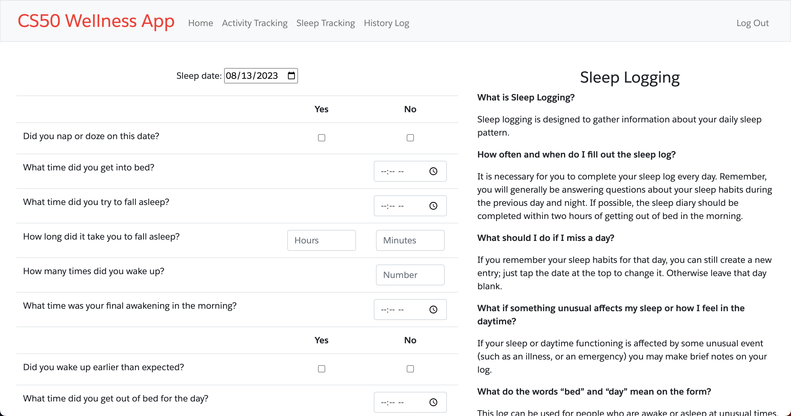
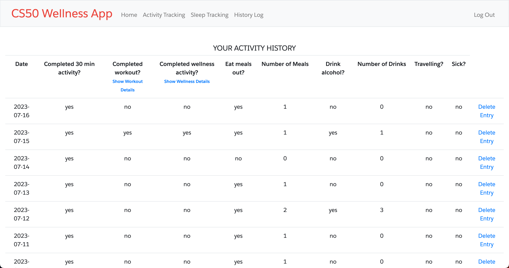

# Wellness App
#### Demo video:  [click here](youtube.com/watch?v=hsnhms7nxcI){:target="_blank"}
<a href="youtube.com/watch?v=hsnhms7nxcI" target="_blank">Youtube Demo Video</a>

## Technology
* JavaScript  
* HTML  
* CSS  
* Python  
* SQLite3  
* Flask  
* chart.js  
* date-fns time adapter  

* Bootstrap  
## Description
Full-stack web application that allows users to easily track activities related to health and well-being, with a focus on physical fitness activities and sleep.  
  
There are two core components of the application, activity logging and sleep logging.  Activity logging was based on a concept to visually track how frequently you're getting 30 minutes of activity per day, performing workouts, peforming wellness activities, etc.  Sleep logging is meant to track when you're going to bed and waking up, if you're waking up throughout the night or waking up early.  This functionality is based on CBT-i app developed by Veteran Affairs.
  
## Motivation
In 2022, my partner and I embarked on a fitness journey challenging ourselves to workout at least 3 times a week, and limit the amount of times we ate meals out or drank alcohol in a week in preparation for a trip to Peru.  We went through an exercise of tracking our workouts and meals in a calendar and notebook.  After a few weeks, it became apparent this wasn't a great way to see how our progress was tracking, which inspired this fitness app.  The idea was to create an easy way to enter information, but then allow the user to visualize historical data and see trends.
## Project Files
### layout.html
This is the Flask template HTML file.  The header of the files includes bootstrap, CSS files, JavaScript files, chart.js, date-fns and JQuery.  The body defines the navigation bar for the web application with links to the various HTML pages and well as defining the logo for the app.  There is also code included to store flash messages when a page renders when applicable.  This creates an experience where the message will populate at the top of the screen.
### login.html
This is the first HTML page a user lands on when launching the application. If the user does not have an account there is a hyperlink that directs the user to the register HTML page, otherwise they are prompted to enter their username and password to login to the application.  Users will also land on this page after successfully logging out of the application.  

### register.html
The register.html page is only accessible to a logged out user, and generally a user will land here from the hyperlink from the login.html page.  They will be prompted to enter a username, as well as enter a password twice to create a new account for the CS50 Wellness App. After successful registration the user will be redirected to the index.html page.   

### index.html
The index.html page acts as the homepage of the web application for logged in users.  This houses a dashboard and summary of information that they've logged in the app.  They are first presented with a calendar view of their activity logging.  The user will notice that there is a legend at the bottom of the screen that guides them as to what activities were performed on a given day.  There is a series of color coding and emojis that are used to signify which activities were completed on which days.  This gives the user a nice visual of activities completed within a given month.  By default the calendar opens with the current month, but the user also has the ability to page back and forth, scrolling through different months to see historical information that has been logged.  Below the activity calendar is a row of stats showing the user some key metrics related to their activities within the past month, such as number of days with 30 minutes of activity, number of workouts in the past month, et.   
Below the activity metrics are the sleep metrics and charts. The user if first greeted with 6 charts that were implemented using chart.js in javascript. These charts were based on the charts from the CBT-i app, which inclues a Sleep Summary (time in bed & time slept), Sleep Efficiency (calculation of time in bed vs time slept), Falling Asleep (when did the user go to bed vs actually fall asleep), Minutes in awake in the night (as reported by the user), Waking Up (what time did the user wake up vs get out of bed), and finally how many minutes did they wake up early in the morning as reported by the user.  The charts pull data from the previous month.  Similarly below the charts, there are metrics related the users reported sleep such as avearage hours slept per night or average time in bed for the last 30 days.    Across the top of the screen the user can navigate to other areas of the application, which is available throughout the application once logged in.  
  

### activity.html
This page is intended to allow the user to log activity information for any given day.  On the left hand side of the screen is the form for user input. On the right hand side of the screen is a description for how to complete the form, helping guide the user if they have questions on how to fill out certain aspects of the form.  I decided to use a table element to organize the fields of information as a way to format them nicely and align the various checkboxes and inputs within the page.  Described more in depth in the JavaScript files section, there is a lot of dynamism built into the form. There are field validations to make sure the user fills out every row within the form.  There is a backend end check that will throw an error if the user tries to submit activity information for a date that already has data logged.  As the user marks that they completed a workout or wellness activity, javascript will populate additional fields for the user to enter, such as what type of workout or wellness activity was completed.  There are hidden HTML fields that are apart of this file. When certain checkboxes are selected, JavaScript will unhide a field, or rehide if the checkbox is unselected.  Users also have the ability to add more than one workout type.  In this scenario, JavaScript is actually creating entirely new fields and appending them to the form.  There is a hidden container within this HTML page where the appended fields are added.  This is done in order to be able to pass data that the user enters on the front end to the backend in Python and SQLite3.  When the user is ready to submit, any errors messages will be thrown at the top of the screen. If the user fills out the information correctly, the information for the form will be logged into the SQLite3 database, and the user will be redirected to the history logging HTML page.  

### sleep.html
This page is intended to allow the user to log sleep information for any given day.  On the left hand side of the screen is the form for user input. On the right hand side of the screen is a description for how to complete the form, helping to guide the user if they have questions on how to fill out certain aspects of the form.  Similar to activity logging, I decided to use a table element to organize the fields of information as a way to format them nicely and align the various checkboxes and inputs within the page.  Different from the activity page, I needed to levarage time intput fields, along with cheboxes and number entries.  Described more in depth in the JavaScript files section, there is dynamism built into the form. There are field validations to make sure the user fills out every row within the form.  There is a backend end check that will throw an error is the user tries to submit sleep information for a date that already has data logged.  As the user marks that they took a nap or woke up early, javascript will populate additional fields for the user to enter, such as how long the nap was.  When the user is ready to submit, any errors messages will be thrown at the top of the screen. If the user fills out the information correctly and passes all the validation checks, the information for the form will be logged into the SQLite3 database, and the user will be redirected to the history logging HTML page.
  

### history.html
This page is intended to show the user a tabular view of activity and sleep logging information.  At the top of the page is activiting logging information, where each row of data represents a day of data that has been logged.  Due to the amount of fields that could be filled in from activity logging, there is more JavaScript dynamism.  There are several workout columns of data that are hidden by default, however by clicking on the "Show Workout Details" hyperlink link, the table will expand to show additional columns of workout data such as workout type, sport type etc.  Additionally there is another hyperlink to show additional details for wellness information, the wellness type.  Considering most individuals may not perform workouts or wellness activities every single day, I decided to simply show the workout y/n and wellness y/n fields, and allow the user to see the additional details if they choose to do so, which prevents overflow of columns of data from occurring. In addition, only the most recent 30 days of activity logging information shows. There is pagination built into the page using JavaScript. At the bottom of the screen there are hyperlinks which bring the user to a specific page of data, or allows paging back and forth between rows of data.
   
Below the activity logging information is the sleep logging information.  There are less columns of data related to sleep logging information, all the columns of data are showing by default.  Similar to activity logging, there is pagination.  Showing the most recent 30 days of data, but allows the user to scroll between pages of data.
  

### apology.html
This page only renders when an error occurs when a user is trying to register a new account, or tries logging in.  I needed to use this type of a page because flash messages would not work when clearing cache at the top of the register.html or login.html python paths.
### styles.css
This file contains a majority of the CSS styling built for the HTML pages utilizing bootstrap.  Some of the primary components that are styled utilizing this file include the activity logging calendar in the index.html page, including where the emojis are positioned within each day of the calendar, the legend for the calendar which highlights how to interpret information on the calendar, the positioning of the chart.js graphs, aspects of the Flask HTML template including the navigation bar, styling for the activity, sleep logging, and history logging page including the pagination.
### app.py
This is the main Python files the defines functions for various HTML pages that make up the application.  Several libraries have been included in the header of the file including Flask, werkzeug, sqlite3, cs50 amongst others.
  
The first function of the file is for index.html.  Index.html acts as the homepage of the application, and this function performs a series of SQL queries from the SQLite3 database to populate homepage information that acts a dashboard for the user to visualize various activity logging and sleep logging information.  The first of which is to populate data for a calendar view to visualize activity logging information for the given month that the user is currently viewing.  A SQL query is performned for activity, workout and lifestyle data.  Data from the SQL query is then parsed into lists specific to activity, workout and lifesytle information to be rendered in the calendar view.  Several loops exist to then create sets of data for day, month and year values with corresponding activities, emojis stored to corresponding days that is used to render CSS formatting in the calendar.  The next SQL query pulls information for the activity stats row on index.html, which a series of exception handling checks if the values or null to assign a value of 0 instead.  The next block of code performs a SQL query to pull all the data used for the chart.js sleep charts, the information then goes through formatting to be rendered correctly in charts.js.  The final SQL query pulls data that makes up the sleep stats row.
  
The next function is for the login screen. If statements check for whether the page was reached by GET or POST dictate which code is executed.  If via GET, the login.html page renders.  If via POST (i.e. the user submitted the login form) there are a series of checks that take place to ensure username was entered and valid, password was entered and valid. An error message is thrown if a flash message is found, otherwise a successful login will bring the user to index.html.
  
The next function is for logout.html, which clears the session and renders the login screen.
  
The next function is for register.html, again the route of code executed is dictated whether the page was reached via GET or POST.  If via POST, there are a series of checks that take place. If any of the checks don't pass, an error message is thrown via flash message, such as if the password inputs don't match, or a username wasn't entered.  With succesful registration, the user is brought to the homepage at index.html.
  
The next function for activty.html.  The first thing that takes place is a check to ensure data wasn't already logged for the day specified in the form.  If data was already logged, an error message is thrown and exits the function.  The following code essentially extracts all the values for the HTML form and stores into variables to be inserted into SQLite3 database.  For certain fields there are checks done to see if they are null, if so they are given 0 values for SQLite3 using a helper function.  Values are then insterted into the appropriate tables and a success message is shown to the user via flash message.
  
The next function is very similar to the previous function although for sleep.html.  The one big difference here is that code needed to be written in order to calculate certain values before they were inserted into the SQLite3 database, such as actual amout of time slept and sleep efficiency.  After the values are stored and calculations are performed, the data is inserted in the SQlite3 databse and a success message is thrown.
  
The final function in this file is for history.html.  This function is essentially a series of SQL queries to pull data to be populated in the history.html tables. Formatting the values using helper functions takes place before they get passed to the HTML page to render the data.
### helpers.py
This file defines helper functions that are used through app.py. The functions can be categorized by either formatting values that are repeated many times, such as converting hours to minutes or minutes to hours and minutes, formatting time values, or populating a variable with Null if a field wasn't filled out within an HTML field.  The bottom three functions store emoji values that are used to assign emoji values to be rendered in the calendar view. This creates more readable and maintainable code within app.py when assigning emoji values.
### activity-logging.js
This JavaScript file serves the purpose to either augment or create dynamism within the activity logging html page (activity.html). 
  
The first feature is to default the date of the activity form to the current date.  The second major feature is to dynamically show additonal fields on the form when certain checkboxes are selected on the form. In addition, there is also code within the event listener that unhides fields, and rehides fields or deletes any appended fields that have been created in the case that a certain checkbox is unselected.  For example, if a user selects that they completed a workout, an additional field will be displayed to enter the type of workout.  But if the user mistakenly said they completed a workout, and then change their selection to "no" workout, the fields for entering additional information on the workout will either be rehidden or deleted.
  
Further below in the file are functions that get called from the event listener to dynamically create the fields and add them to the page.  At the top of file you will find lists of options that make up picklist fields.  These are used to avoid repeating code when creating dynamically added fields.  Below that are functions to create a new div in HTML, as well as a function to create a selection fields to avoid repeating code.  The next block of code is to dynamically create additional workout fields if the user wants to add 2 or more workouts for a given day.  It calls the functions above, appending the selection values and assigning corresponding CSS.  The next feature dynamically creates additional fields if necessary.  For example is the user selects that they played a sport on a dynamically created workout selection field, this javascript will populate an additional selection field for the types of sports to select.  There are also checks that needed to be added to this code in the case that a user added a workout field, then removed it, and then readded another workout type, as it was causing buggy behavior.
  
The next feature adds additional wellness activity selection fields, which acts in the same manner as the code described above.  The next feature deletes dynamically added workout or wellness selection field in the case that a user made a mistake, and selects the "no" checkbox on either the workout or wellness y/n checkboxes.  The next feature in this file takes the user inputs from any dynamically created fields and adds those values to the hidden HTML container in order to pass the values to the backend in Python/SQLite3.
### sleep-logging.js
This JavaScript file has additional field valdations and dynamism for the sleep.html page.  The first block of code defaults the date entry field to today's date.  There is also an event listener that will unhide the amount of time napped in the case that user selects that they napped on the form.  It unhides an HTML field versus dynamically adding it.  There is also code to rehide this field if nap is unselected or no is selected.  The final feature of this file change is to add  an additional field for how long awakenings in the night lasted if a change was made to the "times woken up in the night" field, and the value is greater than 0.The next feature peforms field validation checks.  It checks to ensure every question on the form is completed.  In addition to checking whether the fields are all input, there are two additional checks to ensure the user has input their time entries correctly.  One check to see if the amount of time slept reported by the user is less than 5 hours, or if the amount of time slept is greather than 10 hours. In either case an error message will thrown at the top of the screen.  The user then has a chance to go adjust the values, or if the values are correct, they can hit "okay" and submit the form anyways.  This is simply a way to validate that the time entries are correct.  The next feature performs additional logical validations, such as ensuring the "time in bed" field is earlier than "time attempted to sleep."
### history.js
This final JavaScript file is for the history.html page to implement pagination.  Several functions are defined at the top of the screen to define what rows of data will appear with the next or previous button.  There are listener events at the bootom of the block of code that will execute when the next, previous or a number button is selected.  The next block of code is the exact same functioanlity for pagination but for the sleep logging activity on the history.html page.  The next feature is to delete rows of data from the history.html page.  For every row of data logged, a "delete" hyperlink appears at the end of the row.  If the user hits the hyperlink, it will delete the entire row of data from the SQLite3 database.  The final features at dynamism to the history.html page.  As described above, there were too many columns for any given day related to activity logging without causing overflow.  I used JavaScript to create a hyperlink that when pressed, will unhide several columns of data related to workout activity and wellness activity.  Again the idea being certain fields will be blank and take up a lot of empty space on the screen, but in the case the user wants to see those columns of data they can.
### yes-no.js
This file has a field validation checks to ensure only yes or no is checked for yes/no checkboxes.  Essentially if a user checks yes, and then switches to no, it will uncheck the yes automatically and vice-a-versa. This is used in activity.html and sleep.html.
### schema.db
This is a text file to easily reference the database schema that has been created in SQLite3.  Essentially this is a static file to easily reference the database tables in the same way running the .schema command would render the information.

